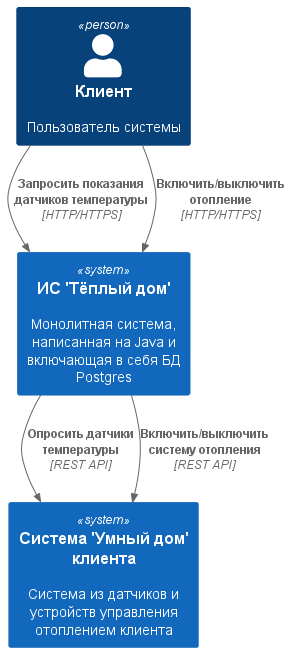
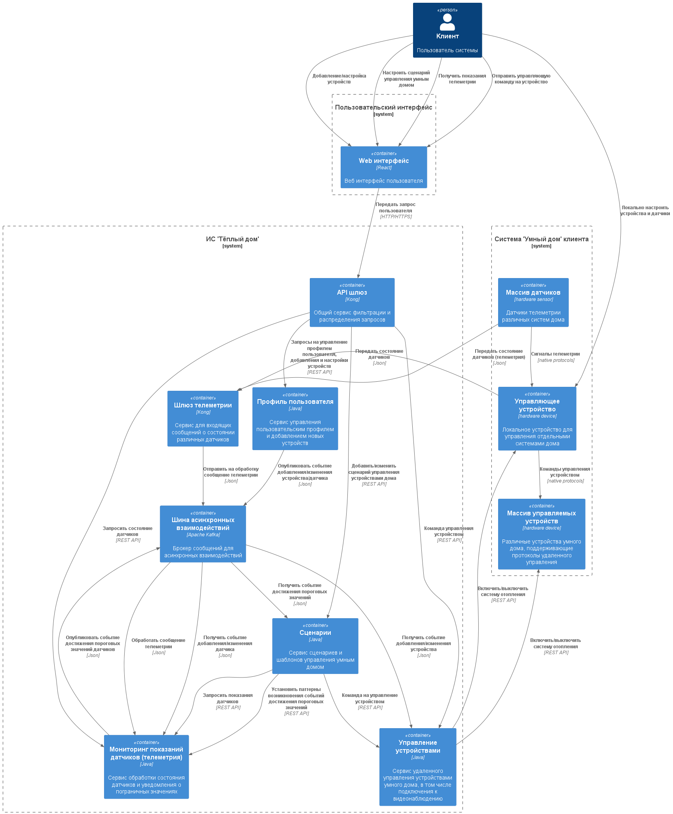
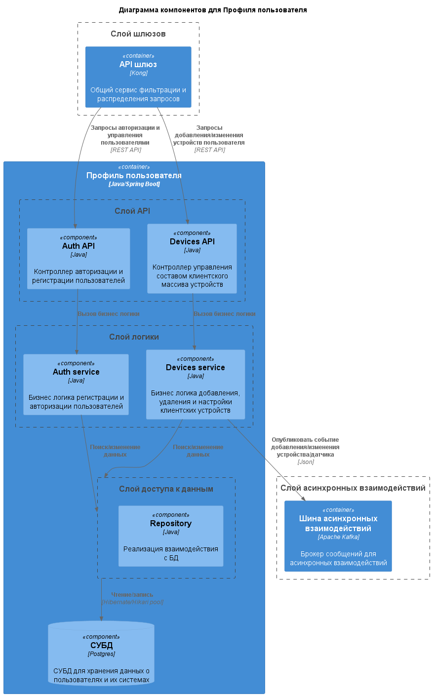
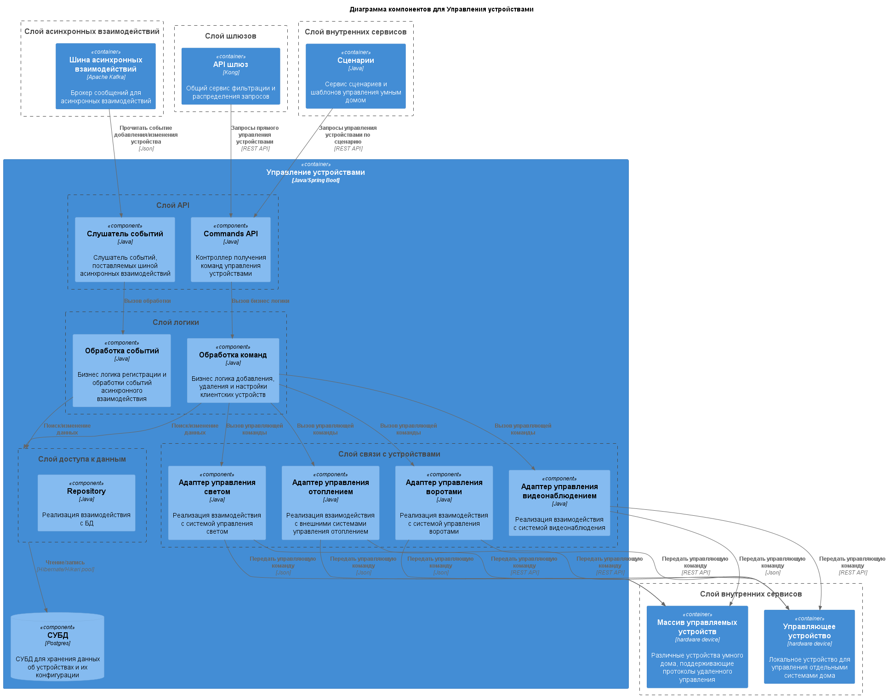
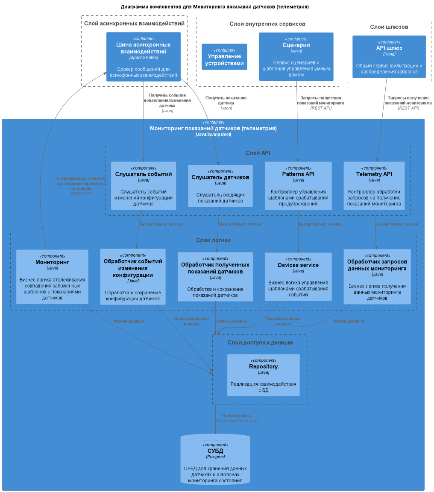
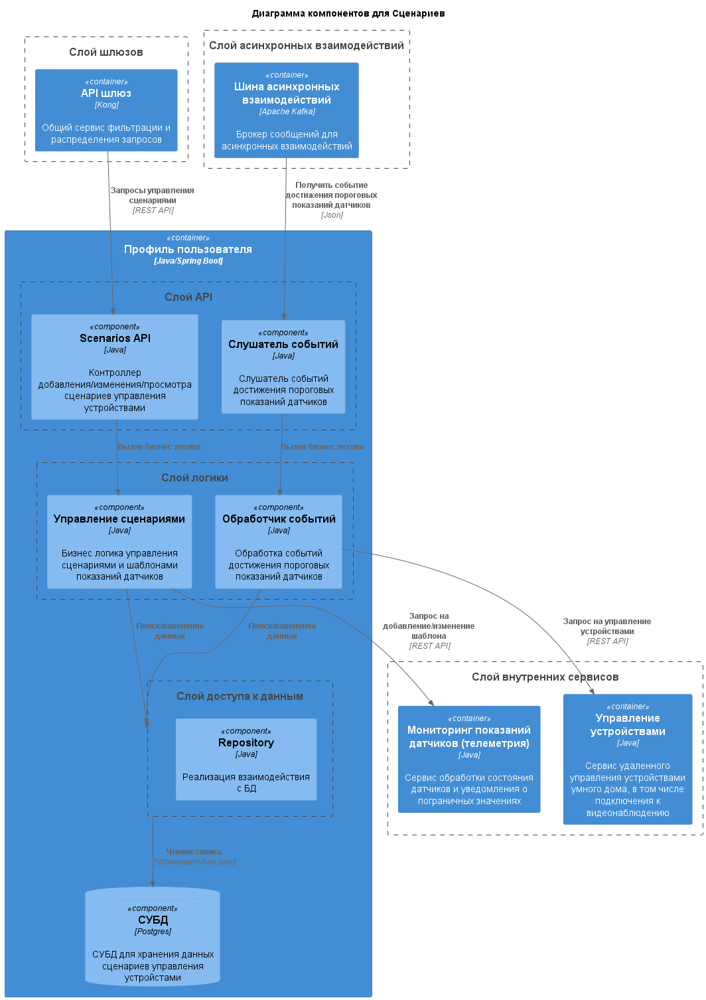
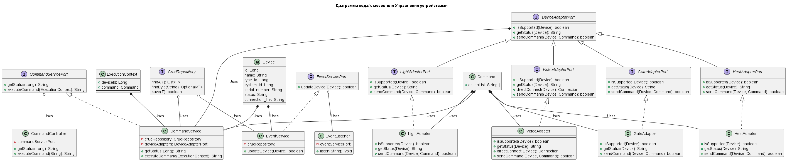
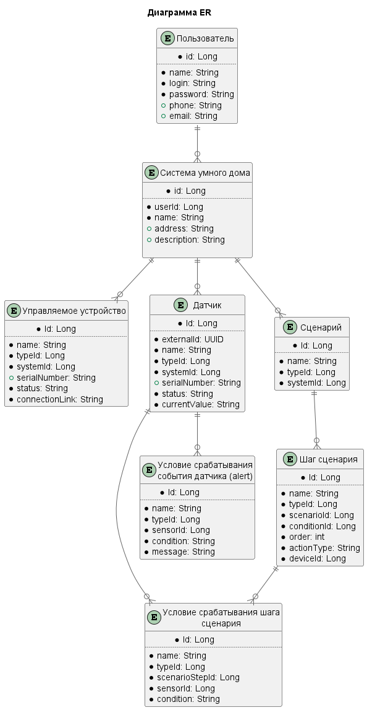

# Project_template

Тип: Материал
Родитель: Описание проекта для 11 когорты (https://www.notion.so/11-03abbbbc8bcb49ed9b85c9b6d1174056?pvs=21)

Это шаблон для решения проектной работы. Структура этого файла повторяет структуру заданий. Заполняйте его по мере работы над решением.

# Задание 1. Анализ и планирование

<aside>
💡

Чтобы составить документ с описанием текущей архитектуры приложения, можно часть информации взять из описания компани и условия задания. Это нормально.

</aside>

### 1. Описание функциональности монолитного приложения

**Управление отоплением:**

- Пользователи могут
  - Удаленно включить отопление
  - Удаленно выключить отопление
    
- Система поддерживает
  - Передать команду на включение/выключение отопления

**Мониторинг температуры:**

- Пользователи могут
  - Удаленно проверить последние зафиксированные данные с датчиков температуры
  
- Система поддерживает
  - Сбор данных с удаленных датчиков температуры

### 2. Анализ архитектуры монолитного приложения

  - **Язык программирования:** Java
  - **База данных:** PostgreSQL
  - **Архитектура:** Монолитная, все компоненты системы (обработка запросов, бизнес-логика, работа с данными) находятся в рамках одного приложения.
  - **Взаимодействие:** Синхронное, запросы обрабатываются последовательно.
  - **Масштабируемость:** Ограничена, так как монолит сложно масштабировать по частям.
  - **Развёртывание:** Требует остановки всего приложения.

### 3. Определение доменов и границы контекстов

  - **Мониторинг показаний датчиков:** сбор данных с удаленных датчиков
  - **Управление устройствами:** возможность передать команду на удаленное устройство
  - **Управление пользователями:** возможность удаленного управления отоплением со стороны пользователя подразумевает наличие пользовательского профиля и авторизацию.

### **4. Проблемы монолитного решения**

  - Прямой опрос датчиков: при росте числа клиентов и датчиков система сбора данных сильно замедлится
  - Строгая синхронность взаимодействий: в случае проблем со связью на стороне клиентского оборудования прогнозируется значительное замедление системы в целом.
  - Сложность масштабирования: при росте числа клиентов монолитное приложение будет сложно масштабировать
  - Проблемы развертывания: необходимость остановки всей системы в случае обновления подразумевает дублирование систем и технических ресурсов для поддержания доступности системы во время технических работ.

### 5. Визуализация контекста системы — диаграмма С4

# Задание 2. Проектирование микросервисной архитектуры

В рамках анализа целевого решения можно предположить, что к уже описанным доменам имеет смысл добавить еще несколько:
  - **API шлюз** -  для синхронных запросов
  - **Шлюз телеметрии**, через который можно будет организовать асинхронное и нагруженное решение для получения данных от датчиков.
  - **Шина асинхронных взаимодействий** например на базе брокера сообщений для операций, не требующих мгновенной реакции или гарантированной доставки
  - **Система сценариев**, с помощью которой можно создавать паттерны управления устройствами на основе показаний датчиков или календарного планирования

Устройства и датчики умного дома могут быть связаны с головным устройством из комплекта поставки, либо связываться напрямую с ИС, если позволяет конструкция и схема построения умного дома 

**Диаграмма контейнеров (Containers)**

**Диаграмма компонентов (Components)**

**Диаграмма кода (Code)**

# Задание 3. Разработка ER-диаграммы

#  ❌ Задание 4. Создание и документирование API

Задание пропущено